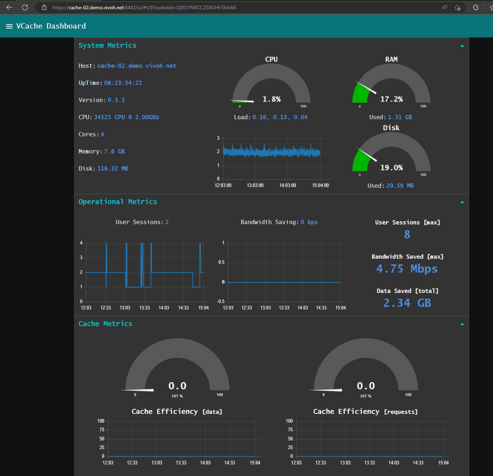
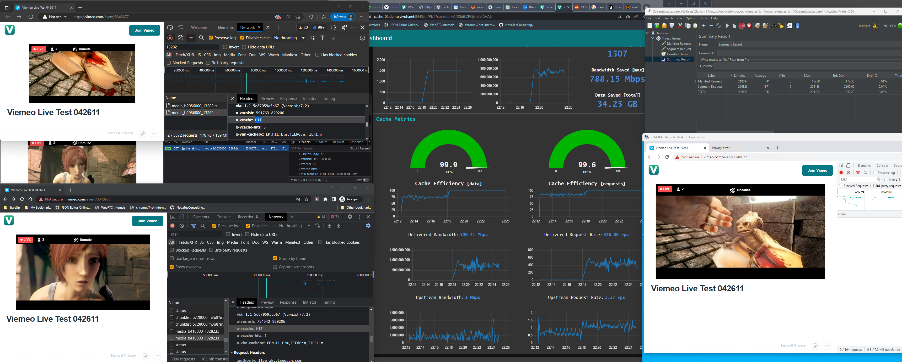

**vCache - High Performance, High Efficiency, Streaming-Video Proxy-Cache**

vCache is a containerized, custom integration, composed of several
open-source components, that implements a streaming-video
proxy-cache. It is a network infrastructure traffic management
application allowing large enterprises, institutions, or any network
environment with large numbers of viewers to consume streaming-video
(HLS, DASH, MSS, MP4, etc.) without saturating upstream networks. In
the absence of some enterprise CDN (eCDN) solution like vCache, WAN
and ISP connections can quickly become congested with video traffic
resulting in poor user experience, missed messaging, and potential
interference with other mission critical network applications.

vCache is primarily based on the world-class CDN caching engine,
Varnish, used in combination with a custom build of nginx for the
frontend and backend processing. vCache uses salt-stack for secure
remote management, and node-red for control-plane operation and
UI. Configuration, operational state, and metrics are stored in a
Redis DB.

vCache can integrate with most standard streaming video environments
in a number of ways. vCache supports a forward-proxy mode and
rever-proxy mode. Basic load-balancing and configuration based routing
is supported via manifest re-write. vCache has aslo been integrated
with NPAW CDN Balancer achieving resilient fault tolerant load
distribution. vCache has also been shown to work with a wide variety
of vendors and streaming platforms (e.g., Vimeo, Brightcove, Kaltura,
etc.).

vCache is designed for high performace, and high compute-efficiency.
vCache can run on minimal hardware with low power consumption while
maintaining high data throughput and requests per second.

vCache ports fairly easily to container based environments. It has
been successfully deployed on Lexmarks edge-compute platform, Optra,
Synology NAS, and other platforms that support "portainer".

vCache may run standalone or operate within a fleet of managed caches
via vCache-Manager (see vcache-manager repository). A bulk deployment
tool, vcache-deploy, is provided which supports SSH-based
mass-deployment.

Author: G. S. Marzot (gmarzot@marzresearch.net)

For additional information or demo, please contach cache@vivoh.com.
